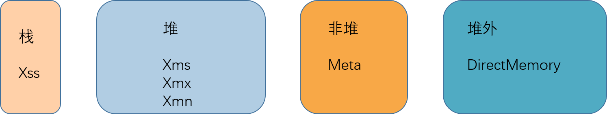

**题目：**

画一张图，展示 Xmx、Xms、Xmn、Meta、DirectMemory、Xss 这些内存参数的关系  。

**答题如下：**

> Xmx：最大堆大小
> Xms：最小堆大小
> Xmn：年轻代大小
> Xss：每个线程的栈大小
> Meta：元空间
> DirectMemory：直接内存

> G1 gc一般推荐Xms==Xmx，同时不设置Xmn，这是由于G1适合由自己完全管理内存，Young区可以根据需要控制有多少个region，如果设置了Xmn，反而定死了Young区。
